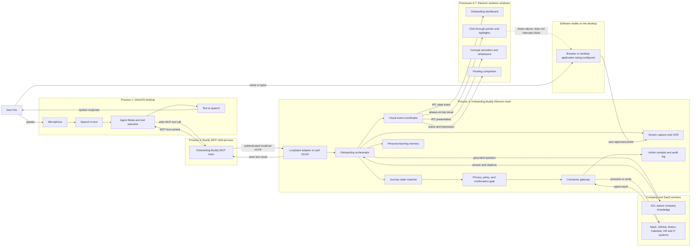
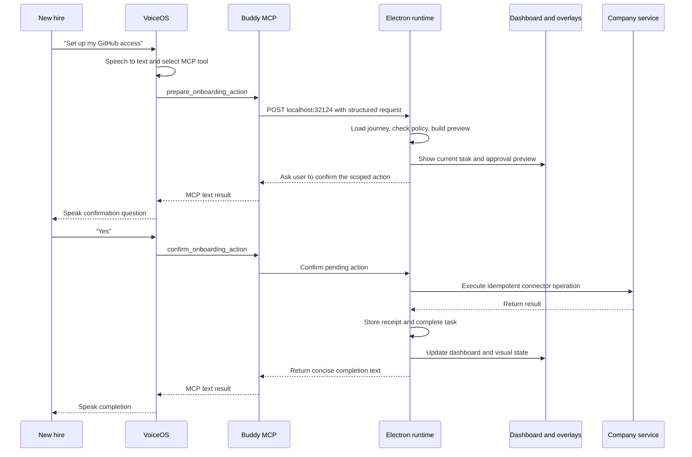

# Onboarding Buddy architecture

This document translates the [Onboarding Buddy business proposal](./AMS_Onboarding_Buddy_Business_Proposal.md) into a high-level technical architecture. It is based on the VoiceOS and Lunem implementation currently developed on `feature/base-product`.

## Architectural decisions

- VoiceOS custom integrations use MCP: local stdio servers exposing tools that return text content blocks. See the [VoiceOS custom integration guide](https://www.voiceos.com/guide/build-mcp-integration).
- `lunem-voiceos/` is the canonical product runtime. The earlier `mcp/ → bridge:8787 → web:5173` stack remains a prototype rather than becoming a second onboarding implementation.
- VoiceOS owns microphone capture, speech-to-text, tool selection, and text-to-speech. The Onboarding Buddy Electron application owns workflows, safety, integrations, memory, screen context, and visuals.
- VoiceOS does not provide a visual channel to custom MCP tools. Dashboards, overlays, pointers, and animations are rendered by the independently running Electron application.
- API or MCP connectors are preferred for provisioning. Screen control is a guided fallback for systems without an integration.
- Sensitive flows such as 401(k) elections remain explanation-and-guidance only. Financial choices require explicit user action, and secrets are never stored.

## Current foundation

The completed G0–G8 work provides the reusable platform:

- VoiceOS stdio MCP integration and an authenticated loopback adapter on `127.0.0.1:32124`.
- A Windows Electron agent with screen capture, OCR, overlays, whiteboards, animations, and action confirmation.
- Durable `remember_fact` memory with privacy safeguards and an optional Mem0 semantic-retrieval provider.
- A public noVNC sandbox for a reduced browser demonstration.

The onboarding-specific layers are not yet implemented: journey state, SaaS provisioning connectors, company knowledge with citations and ACLs, a hire-facing progress dashboard, and audit-grade action receipts.

## Runtime process map

VoiceOS has no direct visual channel into the Buddy. It handles voice and MCP tool selection; the Electron application observes approved desktop context and renders every dashboard, animation, pointer, and highlight.

## End-to-end provisioning turn

## Modules to add

### Onboarding domain and workflow

- Define `Organization`, `HireProfile`, `JourneyTemplate`, `Task`, `Step`, `Approval`, `ActionReceipt`, and `Citation`.
- Use an explicit task state machine: `not_started → ready → awaiting_approval → running → completed | blocked | failed`.
- Keep task completion and provisioning receipts separate from free-form personal memory.

### VoiceOS tool surface

- Add narrow tools such as `get_onboarding_status`, `continue_onboarding`, `explain_current_step`, `answer_company_question`, `prepare_onboarding_action`, `confirm_onboarding_action`, and `remember_fact`.
- Keep MCP handlers stateless and route all work through the authenticated loopback adapter.
- Disable Lunem-local speech for VoiceOS-originated turns to prevent double TTS.
- Make `remember_fact` a direct typed operation rather than relying on the model to reinterpret a generated sentence.

### Connector gateway

- Give each connector the same lifecycle: validate prerequisites, produce a preview, request confirmation, execute idempotently, return a typed receipt, and support retry and reconciliation.
- Start with deterministic fake connectors, then add Slack, GitHub, Notion, and Calendar adapters as credentials and admin scopes become available.
- Do not assume the Buddy can invoke VoiceOS built-in integrations; no such API is documented. Audit-critical provisioning remains Buddy-managed.

### Knowledge and honesty layer

- Ingest a small versioned corpus of HR policy, engineering READMEs, architecture decisions, and tool guides.
- Retrieve only documents authorized for the hire and return citations with every factual answer.
- If no source supports the answer, say “I don’t know” and identify the owner or escalation path.

### Visual coordinator

- Add a live dashboard showing completed, current, blocked, and upcoming tasks.
- Reuse whiteboard and animation actions for concepts.
- Reuse screen OCR and click-through overlays for “click here” guidance.
- Emit visual state from the workflow engine so speech, dashboard state, and overlays cannot drift.

### Persistence, security, and administration

- Preserve loopback binding, body limits, sensitive-text blocking, and confirmation-before-write.
- Add organization and employee scoping, least-privilege connector credentials, and retention controls.
- Add SSO, exportable audit logs, and an admin journey-authoring surface after the MVP.

## Data and memory boundaries

Memory is owned by the Buddy, not VoiceOS. The architecture separates five stores:

1. **Personal memory** — explicit learning preferences and durable user facts such as “I prefer diagrams.” The existing private local memory store is sufficient for the MVP; self-hosted Mem0 remains optional for semantic retrieval.
2. **Workflow state** — authoritative task progress such as “GitHub setup is complete.” This belongs in an onboarding store, not conversational memory.
3. **Company knowledge** — ACL-filtered policies, guides, and engineering documents stored in a cited retrieval index.
4. **Audit receipts** — append-only records of attempted and completed provisioning operations.
5. **Credential vault** — connector tokens and service credentials, isolated from every other store.

Automatic memory should be restricted to safe learning preferences, role context, and accessibility needs. Credentials, salary, health details, benefits selections, raw screenshots, and financial decisions are never remembered.

## End-to-end behaviors

- **Status:** “What’s left?” loads the hire’s journey, focuses the dashboard, and speaks a concise summary.
- **Provisioning:** “Set up GitHub” produces a scoped preview, asks for confirmation, executes through the connector, stores a receipt, and atomically completes the task.
- **Knowledge:** “How does deployment work?” retrieves authorized sources, answers with citations, and opens an explanatory whiteboard when useful.
- **Guided UI:** For unsupported or sensitive systems, the Buddy highlights the next control. The user performs the action, and the Buddy verifies the resulting screen before advancing.
- **Memory:** Personal learning preferences use first-class `remember_fact`; secrets and authoritative task state never enter personal memory.

## Delivery gates

- **G9 — Canonical contracts:** onboarding state machine, event contract, persistence interfaces, fake journey data, and tests.
- **G10 — Voice and dashboard:** VoiceOS status/continue tools, one dashboard, and synchronized spoken and visual progress.
- **G11 — Safe actions:** fake connector, confirmation, idempotent receipt, retry, and audit trail.
- **G12 — Grounded knowledge:** indexed demo corpus, citations, ACL filtering, and verified “I don’t know” fallback.
- **G13 — Integrations:** implement three or four connector adapters behind the common contract; promote each from fake to real only after credentials, scopes, and rollback behavior are proven.
- **G14 — Guided computer use:** verify one unsupported web flow and one concept animation; keep benefits elections guidance-only.
- **G15 — Enterprise hardening:** SSO, tenant isolation, credential vaulting, retention, observability, exportable audit logs, and admin journey authoring.

## Verification

- Contract and state-transition tests for every task status and failure or retry path.
- Connector tests against fakes and sandbox accounts, including idempotency and receipts.
- Knowledge tests for citation correctness, ACL exclusion, prompt-injection resistance, and unsupported questions.
- Safety tests for secrets, financial decisions, destructive actions, cancellation, and double-TTS prevention.
- Windows smoke flow: launch VoiceOS, ask status, explain a concept, approve one provision, observe the dashboard update, persist `remember_fact`, restart, and resume.
- Keep the public sandbox as a separate reduced demo after the Windows vertical slice passes; it must not define production security or persistence semantics.
