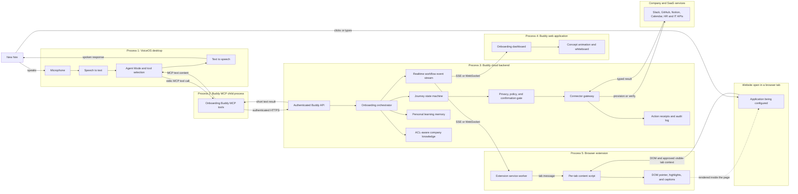
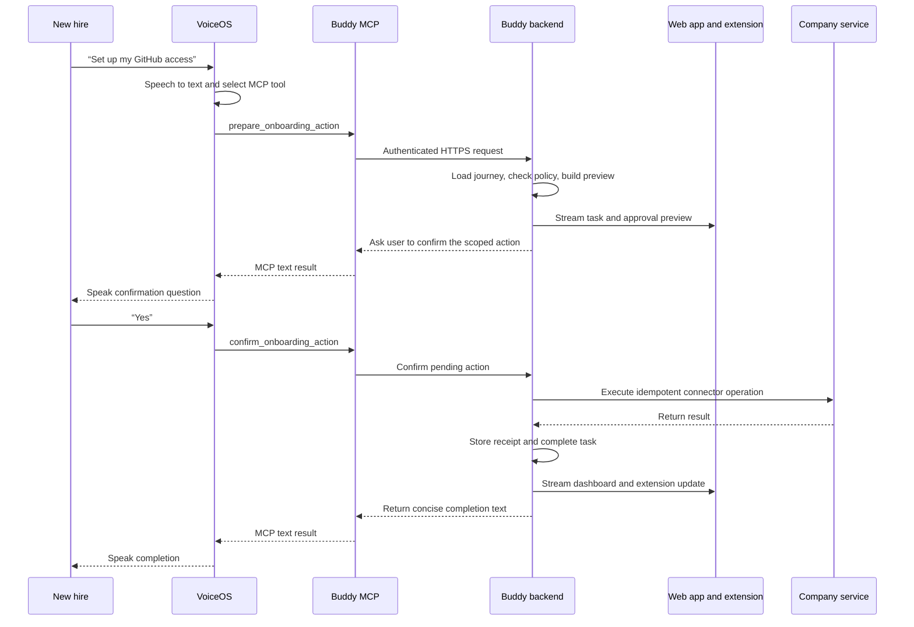

# Onboarding Buddy architecture

This document translates the [Onboarding Buddy business proposal](./AMS_Onboarding_Buddy_Business_Proposal.md) into a high-level technical architecture for a web application and browser extension controlled through VoiceOS.

## Architectural decisions

- VoiceOS custom integrations use MCP: local stdio servers exposing tools that return text content blocks. See the [VoiceOS custom integration guide](https://www.voiceos.com/guide/build-mcp-integration).
- VoiceOS owns microphone capture, speech-to-text, tool selection, and text-to-speech.
- A small headless MCP adapter is the only locally launched Buddy process. It translates VoiceOS stdio tool calls into authenticated HTTPS requests to the Buddy backend; it has no windows or UI.
- The Buddy backend owns workflows, safety, integrations, memory, company knowledge, and audit history.
- The web application owns the onboarding dashboard and concept animations. The browser extension owns page context, pointers, highlights, and guided actions on other websites.
- VoiceOS does not provide a visual channel to custom MCP tools. The backend synchronizes spoken results and browser visuals through workflow events consumed by the web app and extension.
- API or MCP connectors are preferred for provisioning. Extension-driven page guidance is the fallback for websites without an integration.
- Sensitive flows such as 401(k) elections remain explanation-and-guidance only. Financial choices require explicit user action, and secrets are never stored.

## Current foundation

The `feature/base-product` work provides reusable prototypes:

- VoiceOS stdio MCP integration and tool definitions.
- A web application with dashboard, whiteboard, and animation primitives.
- A Chrome extension with page highlighting and content-script capabilities.
- Durable `remember_fact` memory with privacy safeguards and an optional Mem0 semantic-retrieval provider.

The Electron, Windows-control, native screen-capture, always-on-top orb, and noVNC desktop paths are not part of this product architecture. The onboarding-specific backend, browser synchronization, journey state, SaaS provisioning connectors, cited company knowledge, hire-facing progress dashboard, and audit-grade action receipts still need to be implemented.

## Runtime process map

VoiceOS has no direct visual channel into the Buddy. It handles voice and MCP tool selection; the backend emits correlated workflow events to the web application and extension. The extension can inspect and annotate authorized browser tabs, but it cannot overlay native desktop applications, browser chrome, protected pages, or operating-system dialogs.

## End-to-end provisioning turn

## Modules to add

### Onboarding domain and workflow

- Define `Organization`, `HireProfile`, `JourneyTemplate`, `Task`, `Step`, `Approval`, `ActionReceipt`, and `Citation`.
- Use an explicit task state machine: `not_started → ready → awaiting_approval → running → completed | blocked | failed`.
- Keep task completion and provisioning receipts separate from free-form personal memory.

### VoiceOS tool surface

- Add narrow tools such as `get_onboarding_status`, `continue_onboarding`, `explain_current_step`, `answer_company_question`, `prepare_onboarding_action`, `confirm_onboarding_action`, and `remember_fact`.
- Keep the headless MCP adapter stateless and route all work to the authenticated Buddy HTTPS API.
- Use a short-lived device or user token so tool calls resolve to the same employee and organization as the signed-in web app and extension.
- Return concise text for VoiceOS to speak; the Buddy does not run a second speech runtime.
- Make `remember_fact` a direct typed operation rather than relying on the model to reinterpret a generated sentence.

### Connector gateway

- Give each connector the same lifecycle: validate prerequisites, produce a preview, request confirmation, execute idempotently, return a typed receipt, and support retry and reconciliation.
- Start with deterministic fake connectors, then add Slack, GitHub, Notion, and Calendar adapters as credentials and admin scopes become available.
- Do not assume the Buddy can invoke VoiceOS built-in integrations; no such API is documented. Audit-critical provisioning remains Buddy-managed.

### Knowledge and honesty layer

- Ingest a small versioned corpus of HR policy, engineering READMEs, architecture decisions, and tool guides.
- Retrieve only documents authorized for the hire and return citations with every factual answer.
- If no source supports the answer, say “I don’t know” and identify the owner or escalation path.

### Visual coordinator

- Add a live dashboard showing completed, current, blocked, and upcoming tasks.
- Reuse whiteboard and animation actions for concepts.
- Use extension content scripts and DOM geometry for pointers, highlights, captions, and guided actions on authorized websites.
- Use visible-tab screenshots and vision only as a permissioned fallback when DOM context is insufficient.
- Synchronize VoiceOS replies, dashboard updates, and extension commands with a shared `turnId` and ordered workflow events.
- Default to highlighting the next control. Programmatic click, typing, or form submission requires a scoped preview and explicit confirmation.

### Persistence, security, and administration

- Validate every MCP request at the Buddy API and apply body limits, sensitive-text blocking, and confirmation-before-write.
- Add organization and employee scoping, extension origin and host-permission checks, least-privilege connector credentials, and retention controls.
- Add SSO, exportable audit logs, and an admin journey-authoring surface after the MVP.

## Data and memory boundaries

Memory is owned by the Buddy backend, not VoiceOS or the extension. The architecture separates five stores:

1. **Personal memory** — explicit learning preferences and durable user facts such as “I prefer diagrams.” Store these in the organization-scoped backend; self-hosted Mem0 remains an optional semantic-retrieval provider.
2. **Workflow state** — authoritative task progress such as “GitHub setup is complete.” This belongs in an onboarding store, not conversational memory.
3. **Company knowledge** — ACL-filtered policies, guides, and engineering documents stored in a cited retrieval index.
4. **Audit receipts** — append-only records of attempted and completed provisioning operations.
5. **Credential vault** — connector tokens and service credentials, isolated from every other store.

Browser storage contains only replaceable caches and short-lived session material. Automatic memory should be restricted to safe learning preferences, role context, and accessibility needs. Credentials, salary, health details, benefits selections, raw screenshots, and financial decisions are never remembered.

## End-to-end behaviors

- **Status:** “What’s left?” loads the hire’s journey, focuses the dashboard, and speaks a concise summary.
- **Provisioning:** “Set up GitHub” produces a scoped preview, asks for confirmation, executes through the connector, stores a receipt, and atomically completes the task.
- **Knowledge:** “How does deployment work?” retrieves authorized sources, answers with citations, and opens an explanatory whiteboard when useful.
- **Guided UI:** For unsupported or sensitive websites, the extension highlights the next DOM control. The user performs the action, and the extension verifies the resulting page state before advancing.
- **Memory:** Personal learning preferences use first-class `remember_fact`; secrets and authoritative task state never enter personal memory.

## Delivery gates

- **G9 — Canonical contracts:** onboarding state machine, authenticated API, event contract, persistence interfaces, fake journey data, and tests.
- **G10 — Voice and dashboard:** headless VoiceOS MCP adapter, status/continue tools, one web dashboard, and synchronized spoken and visual progress.
- **G11 — Safe actions:** fake connector, confirmation, idempotent receipt, retry, and audit trail.
- **G12 — Grounded knowledge:** indexed demo corpus, citations, ACL filtering, and verified “I don’t know” fallback.
- **G13 — Integrations:** implement three or four connector adapters behind the common contract; promote each from fake to real only after credentials, scopes, and rollback behavior are proven.
- **G14 — Browser guidance:** synchronize the extension, verify one unsupported website flow and one concept animation, and keep benefits elections guidance-only.
- **G15 — Enterprise hardening:** SSO, tenant isolation, credential vaulting, retention, observability, exportable audit logs, and admin journey authoring.

## Verification

- Contract and state-transition tests for every task status and failure or retry path.
- Connector tests against fakes and sandbox accounts, including idempotency and receipts.
- Knowledge tests for citation correctness, ACL exclusion, prompt-injection resistance, and unsupported questions.
- Extension tests for host permissions, DOM targeting, cross-origin frames, protected pages, stale tabs, and reconnecting to the event stream.
- Safety tests for secrets, financial decisions, destructive actions, cancellation, and unauthorized extension commands.
- Browser smoke flow: launch VoiceOS, sign into the web app and extension, ask status, explain a concept, approve one provision, observe the dashboard and target tab update, persist `remember_fact`, restart, and resume.
